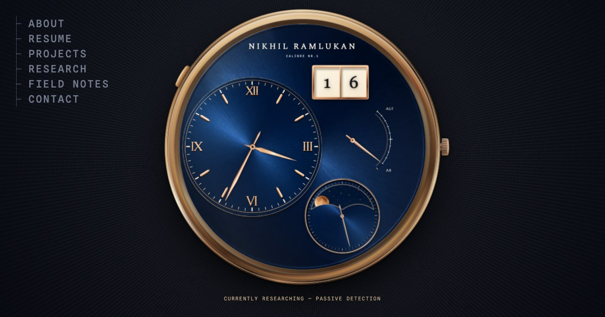

# Calibre NR.1

My personal site, built as a working A. Lange & Söhne Lange 1.

**Live: [nikhilramlukan.com](https://www.nikhilramlukan.com)** — desktop gets the watch; phones get a plain-text edition of the same content.



## What it does

Every section of the site is a complication. The outsize date opens Projects, the power reserve is the resume — scrolling it winds the movement — the small seconds opens Research, and the moonphase opens my reading list. The moon tracks the real moon; the date is today's. Click the crown and the watch turns over: the movement on the back carries perlage, Glashütte ribbing, anglage, and cut engraving, and three of its gears are my contact links. Two of them genuinely mesh — centre distance equal to the sum of the pitch radii, tip circles overlapping by 2m.

Hold the crown and the seconds hand stops, the way a real calibre hacks. The light runs warmer in the evening than at noon. A few other things are not written down here.

## How it's made

Vanilla HTML, CSS, and JavaScript on a Vite build. No framework; the only third-party code is Vercel's own analytics, served from this domain — the fonts (Spectral, Source Sans 3, Spline Sans Mono, all SIL OFL) are self-hosted. The watch is rendered art: the movement is assembled from individually cut part sprites over a wheel-less base, occluded by hand-cut plates so wheels run under bridges. Positions on the caseback are measured, not placed — the git log carries the arithmetic.

The mobile edition is the same DOM restyled: no duplicated copy, readable with JavaScript disabled, ~370KB against the desktop's full weight.

## Run it

```
npm install
npm run dev
```

Vite serves on port 8765.
